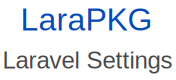

<p align="center">
    
    <br>
    <br>
    
    
    
</p>

Adds **simple** settings to any Laravel application.

### Usage

#### Retrieving a setting

- Using the helper
```php
setting('setting_group.key');
```

- Using the facade
```php
\LaraPkg\Settings\Facades\Setting::get('key', 'setting_group');
```

#### Setting a setting

- Using the helper
```php
set_setting('setting_group.key', 'Some value!');
```

- Using the Facade
```php
$value = 'something to store';
\LaraPkg\Settings\Facades\Setting::set('key', $value, 'setting_group');
```

### Installation

```shell script
composer require larapkg/laravel-settings
```
